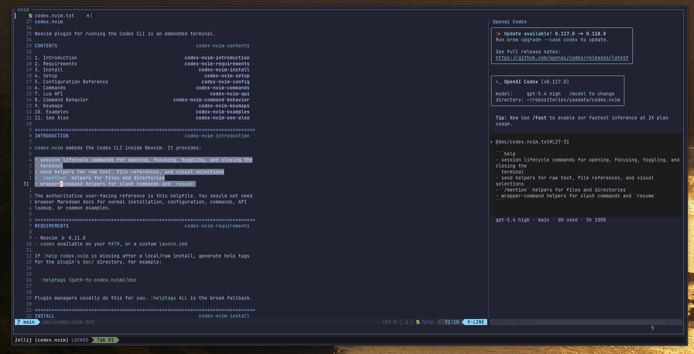

<p align="center">
    
</p>

<div align="center" >

# CODEX.NVIM

<i>Bringing Openai Codex to Neovim </i>



| **Primary home:** [Codeberg](https://codeberg.org/yaadata/codex.nvim) | Mirrored on [GitHub](https://github.com/yaadata/codex.nvim) |
| :-------------------------------------------------------------------: | :---------------------------------------------------------: |

</div>

## ✨ Features

- 🧩 Composable by default. Session control, send helpers, mention helpers,
  slash commands, and resume flows are available as both `:Codex*` commands and
  a public Lua API.
- 🔌 API-first instead of UI-first. Build your own workflows on top of
  `require("codex")` with primitives for opening, sending, mentioning, resuming,
  clearing input, and more.
- 🌱 Fits into the Neovim ecosystem. Lazy-load on commands, use the built-in
  terminal provider or `snacks`, and attach your own terminal-local keymaps
  without fighting rigid plugin assumptions.
- 🔄 Built to evolve with Codex. The plugin wraps real Codex flows like
  `/mention`, slash commands, ACP file references, and `codex resume` instead of
  inventing a separate abstraction that drifts from the CLI.
- 🎯 Comfortable for interactive use, but scriptable when you need more. Open,
  focus, toggle, send selections, send files, or keep editor focus while
  composing larger integrations.
- 📚 Documented for users and plugin authors. `:help codex.nvim` covers
  commands, config, behavior notes, examples, and the public API in one place.

## Requirements

- Neovim >= 0.11.0
- `codex` available on your `PATH` (or configure `launch.cmd`)

> [!CAUTION]
> You are reading the `main` branch README. Install details may differ from
> tagged releases. The current latest release tag is
> [`v1.0.0`](https://codeberg.org/yaadata/codex.nvim/src/tag/v1.0.0). For
> version-accurate instructions, read the README for your target tag from
> [Codeberg releases](https://codeberg.org/yaadata/codex.nvim/releases).

## Install

```lua
{
  url = "https://codeberg.org/yaadata/codex.nvim.git",
  version = "1.0.0",
  cmd = {
    "Codex",
    "CodexFocus",
    "CodexClose",
    "CodexClearInput",
    "CodexSendSelection",
    "CodexSendFile",
    "CodexMentionFile",
    "CodexMentionDirectory",
    "CodexResume",
  },
  opts = {},
  config = function(_, opts)
    require("codex").setup(opts)
  end,
}
```

## Usage

After installation, open `:help codex.nvim` inside Neovim for the full
user-facing reference, including:

- setup and the full default options table
- command reference and behavior notes
- public Lua API
- keymap examples
- slash-command examples

Common entry points:

- `:Codex` toggles the Codex terminal
- `:CodexSendSelection` sends the active visual selection
- `:CodexSendFile` sends the current buffer as an ACP file reference
- `:CodexMentionFile [path]` and `:CodexMentionDirectory [path]` send `/mention`
- `:CodexResume[!]` resumes in-process or launches `codex resume`

If `:help codex.nvim` is missing after a local/raw install, generate help tags
for the plugin's `doc/` directory, for example
`:helptags {path-to-codex.nvim}/doc`. Plugin managers usually do this for you;
`:helptags ALL` is the broad fallback.

## Developer Docs

The main runtime docs are in [doc/codex.nvim.txt](doc/codex.nvim.txt).
Developer-oriented docs remain in:

- [doc/architecture.md](doc/architecture.md)
- [doc/contributing.md](doc/contributing.md)
- [doc/troubleshooting.md](doc/troubleshooting.md)
