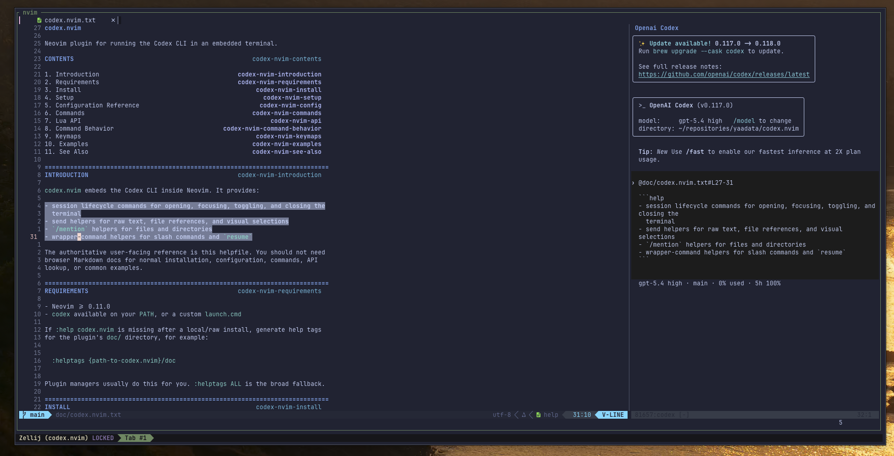

<p align="center">
    
</p>

<div align="center" >

# CODEX.NVIM

<i>Bringing Openai Codex to Neovim </i>



| **Primary home:** [Codeberg](https://codeberg.org/yaadata/codex.nvim) | Mirrored on [GitHub](https://github.com/yaadata/codex.nvim) |
| :-------------------------------------------------------------------: | :---------------------------------------------------------: |

</div>

## ✨ Features

- 🧩 Compose workflows with session, input, prompt-builder, and log APIs.
- 🔌 Use `codex.builtin` for agent-specific mentions, slash commands, skills,
  and resume flows.
- 🌱 Use the native terminal provider or `snacks`, lazy-load on commands, and
  configure terminal-local keymaps.
- 📚 Use `:help codex.nvim` for configuration, commands, and keymap examples.

## Requirements

- Neovim >= 0.12.0
- `codex` available on your `PATH` (or configure `launch.cmd`)

> [!CAUTION]
> You are reading the `main` branch README. Install details may differ from
> tagged releases. The current latest release tag is
> [`2.0.0-alpha.3`](https://codeberg.org/yaadata/codex.nvim/src/tag/v2.0.0-alpha.2).
> For version-accurate instructions, read the README for your target tag from
> [Codeberg releases](https://codeberg.org/yaadata/codex.nvim/releases).

## Install

```lua
{
  url = "https://codeberg.org/yaadata/codex.nvim.git",
  version = "2.0.0-alpha.3",
  lazy = false,
  cmd = {
    "Codex",
    "CodexFocus",
    "CodexClose",
    "CodexClearInput",
    "CodexSendSelection",
    "CodexSendFile",
    "CodexMentionFile",
    "CodexMentionDirectory",
  },
  opts = {},
  config = function(_, opts)
    require("codex").setup(opts)
  end,
}
```

This configuration supports `:Lazy reload codex.nvim`. Reload closes any active
Codex terminal.

## Configuration

Use this as a quick-reference setup example. For full behavior notes and the
complete user-facing reference, see `:help codex.nvim`.

```lua
-- codex.Config
-- :help codex-nvim-config
require("codex").setup({

  -- codex.LaunchConfig
  -- :help codex-nvim-launch
  launch = {
    cmd = "codex", -- executable to launch
    args = {}, -- extra CLI args
    env = {}, -- extra environment variables
    auto_start = true, -- open a session after setup
    cwd = nil, -- nil = current Neovim working directory
  },

  -- codex.TerminalConfig
  -- :help codex-nvim-terminal
  terminal = {
    provider = "auto", -- prefer snacks when available, otherwise native
    auto_close = true, -- close after the Codex process exits

    -- codex.StartupConfig
    startup = {
      timeout_ms = 2000,
      retry_interval_ms = 50,
      grace_ms = 800,
    },

    -- codex.TerminalKeymapConfig
    -- :help codex-nvim-keymaps
    keymaps = {},

    -- codex.ProviderOptsConfig
    provider_opts = {
      -- codex.NativeProviderOpts
      native = {
        window = "vsplit",
        -- codex.VsplitConfig
        vsplit = {
          side = "right",
          size_pct = 40,
        },
        -- codex.HsplitConfig
        hsplit = {
          side = "bottom",
          size_pct = 30,
        },
        -- codex.FloatConfig
        float = {
          width_pct = 80,
          height_pct = 80,
          border = "rounded",
          title = " Codex ",
          title_pos = "center",
        },
      },
      snacks = {}, -- snacks.terminal(..., opts) pass-through
    },
  },

  -- codex.LogConfig
  -- :help codex-nvim-log
  log = {
    level = "warn",
    verbose = false,
  },

  -- codex.HooksConfig
  -- :help codex-nvim-hooks
  hooks = {
    on_setup = nil,
    on_terminal_open = nil,
    on_terminal_restore = nil,
    on_terminal_close = nil,
  },
})
```

## Usage

Common entry points:

- `:Codex` toggles the terminal; `:Codex!` opens and focuses it.
- `:CodexSendSelection` sends the active visual selection.
- `:CodexSendFile` sends the current buffer as an ACP file reference.
- `:CodexMentionFile [path]` and `:CodexMentionDirectory [path]` send
  `/mention`.

For Lua workflows, use [`require("codex")`](lua/codex/init.lua) for `session`,
`input`, `prompt_builder`, and `logs`. Use
[`require("codex.builtin")`](lua/codex/builtin/init.lua) for agent-specific
workflows.

Example:

```lua
local prompt = require("codex").prompt_builder
prompt.clear()
prompt.add("Review this file: ")
local ok, err = prompt.add_file()
if not ok then
  vim.notify(err, vim.log.levels.ERROR)
  return
end
prompt.send() -- paste the draft without pressing Enter
```

Open `:help codex.nvim` for configuration, commands, and keymaps. If help is
missing after a raw install, run `:helptags {path-to-codex.nvim}/doc`. Plugin
managers usually generate tags automatically.

## Developer Docs

- [doc/architecture.md](doc/architecture.md)
- [doc/contributing.md](doc/contributing.md)
- [doc/troubleshooting.md](doc/troubleshooting.md)
